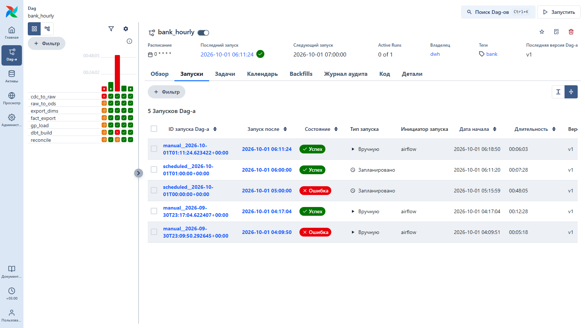
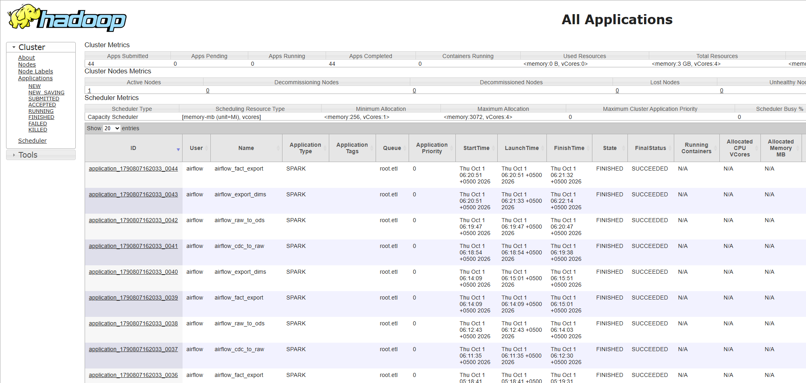
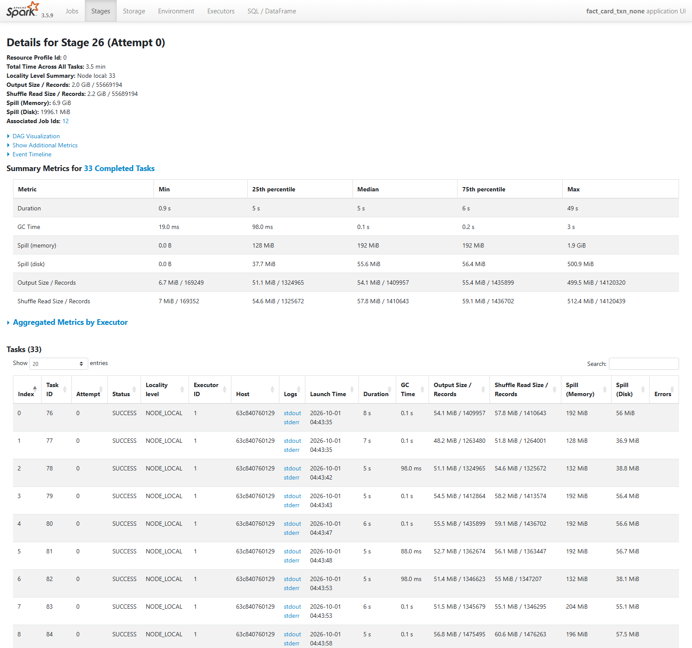
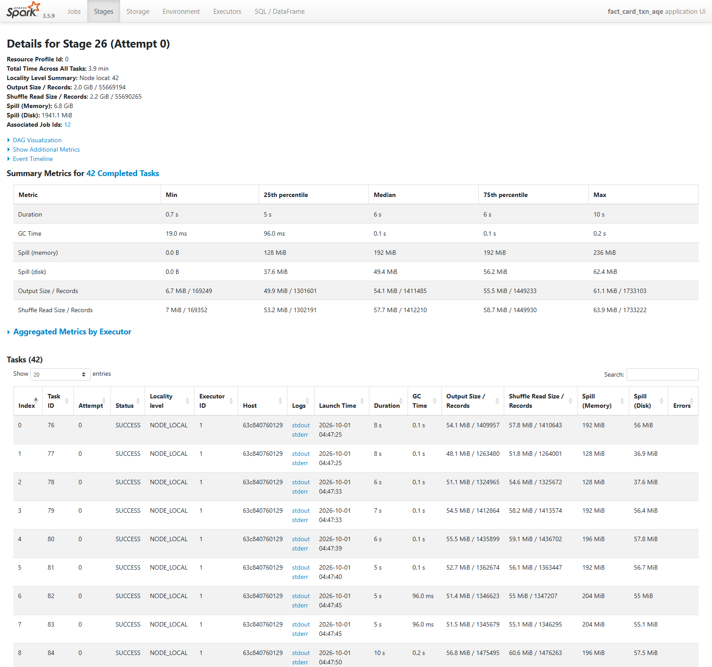
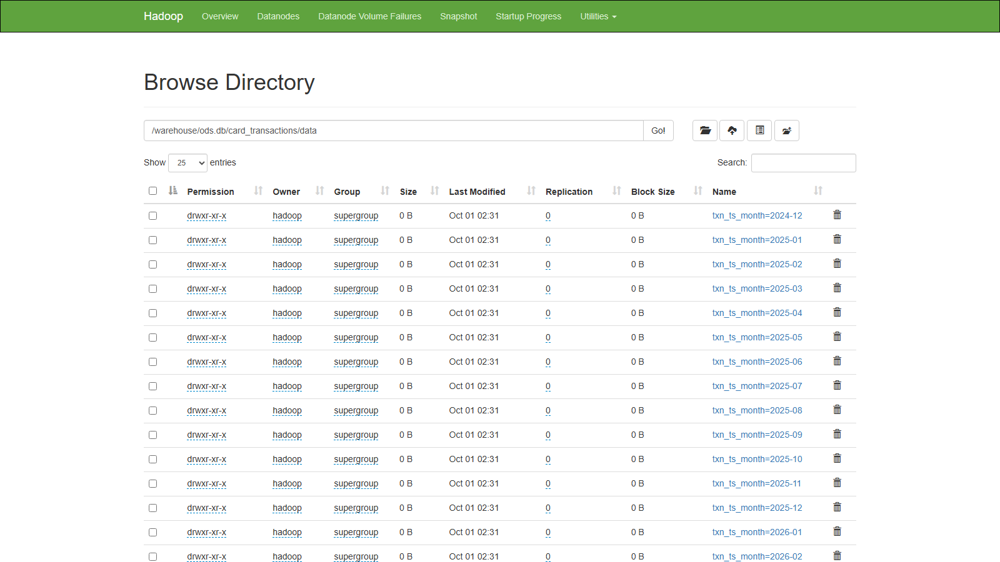
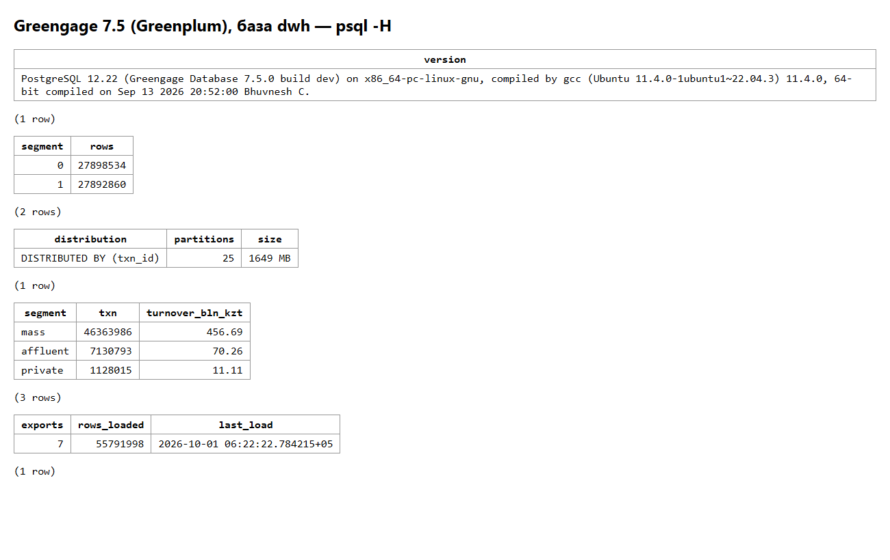

# Скриншоты стенда

Сняты 1 октября 2026 года на работающем стенде, после чего стенд удалён, чтобы
освободить место на ноутбуке. Данные **сгенерированы** (`bank generate`): 55,6 млн
операций за январь 2025 — сентябрь 2026; настоящих банковских данных здесь нет.
Поднять стенд заново — по [README](../README.md) и [runbook](runbook.md).

## Airflow: почасовой DAG

Пять запусков `bank_hourly`. Первый ручной упал на настройке провайдера Spark,
плановый в 05:00 — на зависании API Airflow (разбор в [decisions.md](decisions.md)),
после перевода витрин на инкремент цикл идёт 6–7,5 минуты.

## YARN: приложения Spark из Airflow

44 приложения, все в очереди `etl`, режим cluster; кластер — 3 ГБ и 4 ядра.

## Spark: перекос в соединении с ТСП

Стадия соединения без защиты от перекоса: медиана задачи 5 с и 1,4 млн записей,
самая долгая — 49 с и 14,1 млн записей (маркетплейс).

Та же стадия с AQE skew join: 42 задачи вместо 33, максимум 10 с.

## HDFS: ods в Iceberg

Месячные партиции `card_transactions`; партиция 2024-12 появилась из-за того,
что `months()` считает месяц в UTC.

## Greenplum: факт и витрина

Вывод `psql -H`: 55,8 млн строк факта поровну на двух сегментах, распределение
по `txn_id`, 25 партиций; оборот по сегментам клиента; журнал загрузок через PXF.

